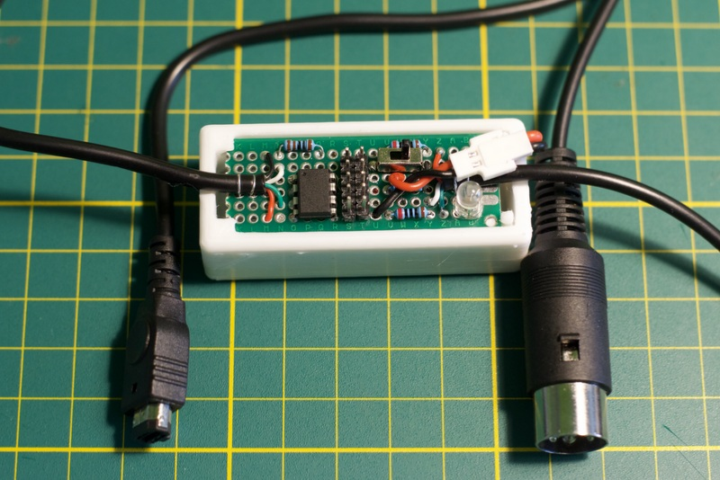
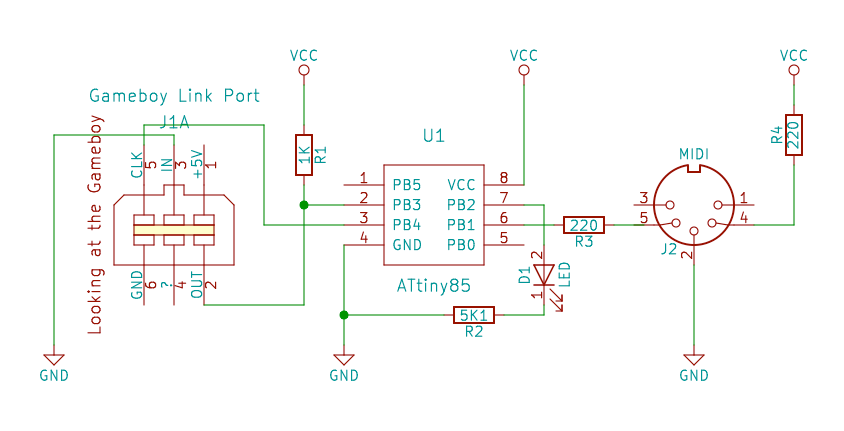

# LSDJmi

This is the firmware for a little dongle providing MIDI out interface for "Arduinoboy" version of LSDJ.

**Project status:** usable but missing support for scaled CC and CC/channel configuration directly from LSDJ.

The actual [Arduinoboy](https://github.com/trash80/Arduinoboy) by **trash80** supports other Gameboy programs and more modes of operation. Check it out.

Similar to Arduinoboy the LSDJmi dongle allows to control other synthesizers using familiar tracker interface of LSDJ. You can play a drum machine or a bass synth together with your chiptune or you can can use your Gameboy solely as an external sequencer, which sometimes can be more powerful than a built-in sequencer of an external synth.

## How does it work?

The "Arduinoboy" build of LSDJ supports the following extra commands (you can find them after the standard **Z** command):

 - **N**`xx` - send an arbitrary MIDI note `xx`.
 - **Q**`xx` - send a note corresponding to the pitch in the current Gameboy channel transposed by `xx` semitones.
 - **X**`xx` - send a Control Change message with the value `xx` to a control associated with the current channel (can also work with multiple controls if enabled); this allows to control knobs of your external gear. 
 - **Y**`xx` - send a Program Change message which allows you to change the current patch of your synth.

These commands are received by the dongle from the Link port and the corresponding MIDI messages are generated on the MIDI out port of the dongle.

(Note that because of the communication protocol the `xx` argument in all the commands above should be in the range 00-6F.)

## Configuration

Each Gameboy channel has the following settings associated with it on the dongle side:

 - the MIDI channel to use for CC, PC and notes coming from this channel (hardcoded);
 - the velocity for every note being sent (not implemented, always 0x7F);
 - the mode CC commands (**X**`xx`) are interpreted (hardcoded):
    - in the **single** mode there is only one control associated with the Gameboy channel, so the value from any **X**`xx` command will be translated from the command's 00-6F range into MIDI's 00-7F and sent to the associated control;
    - in the **scaled** mode there can be up to 7 controls associated with the Gameboy channel, the first nibble of the argument to **X**`xx` command is interpreted as the index of the control (0-6) and the second one will be scaled from 0-F range into MIDI's 00-7F.

Currently the configuration can be changed only by recompiling the firmware. Arduinoboy allows to change its configuration via special messages on its MIDI in sent by a dedicated tool. For LSDJmi I would like to implement the following:

Unlike Arduinoboy the `Y6F` command is not treated as Program Change to 111, but instructs LSDJmi to treat the following **X**`xx` commands as configuration changes:
 - **X**`mc` defines the MIDI channel by its `c` nibble, and defines how many CCs should be associated with the channel via `m`:
   - 0 means no changes in the current config;
   - 1 selects the 'single' CC mode with the following single **X**`xx` command defining the MIDI CC number;
   - 2-7 selects the 'scaled' CC mode, and the following `m` **X**`xx` commands define the MIDI CC numbers to associate with the numbers in the high nibble of the **X**`xx` command.
 - the next 0-7 **X**`cc` commands define MIDI CC numbers to use (depends on the mode, see above);
 - the last **X**`vv` command defines the default velocity of every note on this Gameboy channel.

## Schematics

I am using a bare ATtiny85 for this project, but any Arduino-compatible board should work just fine, you'll need only 3 pins:

 - CLK pin of the Gameboy;
 - OUT pin of the Gameboy;
 - a pin for the MIDI out.

Here is my schematics for the completeness. 

Note that I am using a pull-up on the `OUT` pin (`R1`) because the end of the link cable I have is missing a `GND` wire. You should not need the pull-up if your cable is OK.

Also note that the LED is really optional. I've added it later so I don't forget to switch the power off. You might want to pick different value for its current limiting resistor.

Speaking of power, `VCC` is tied directly to a 3.7V LiPo battery, one of those used with drones.

---
